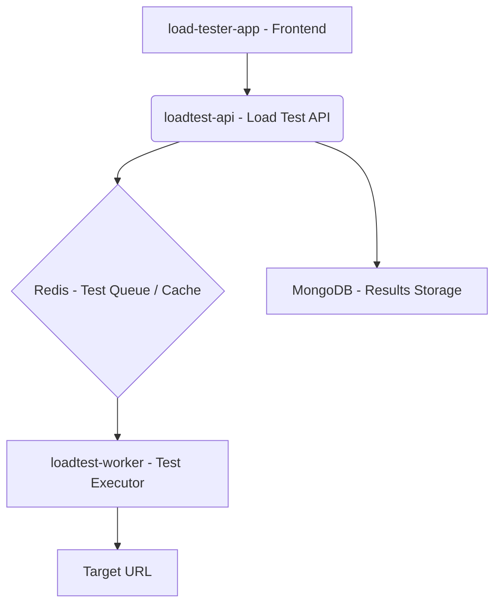
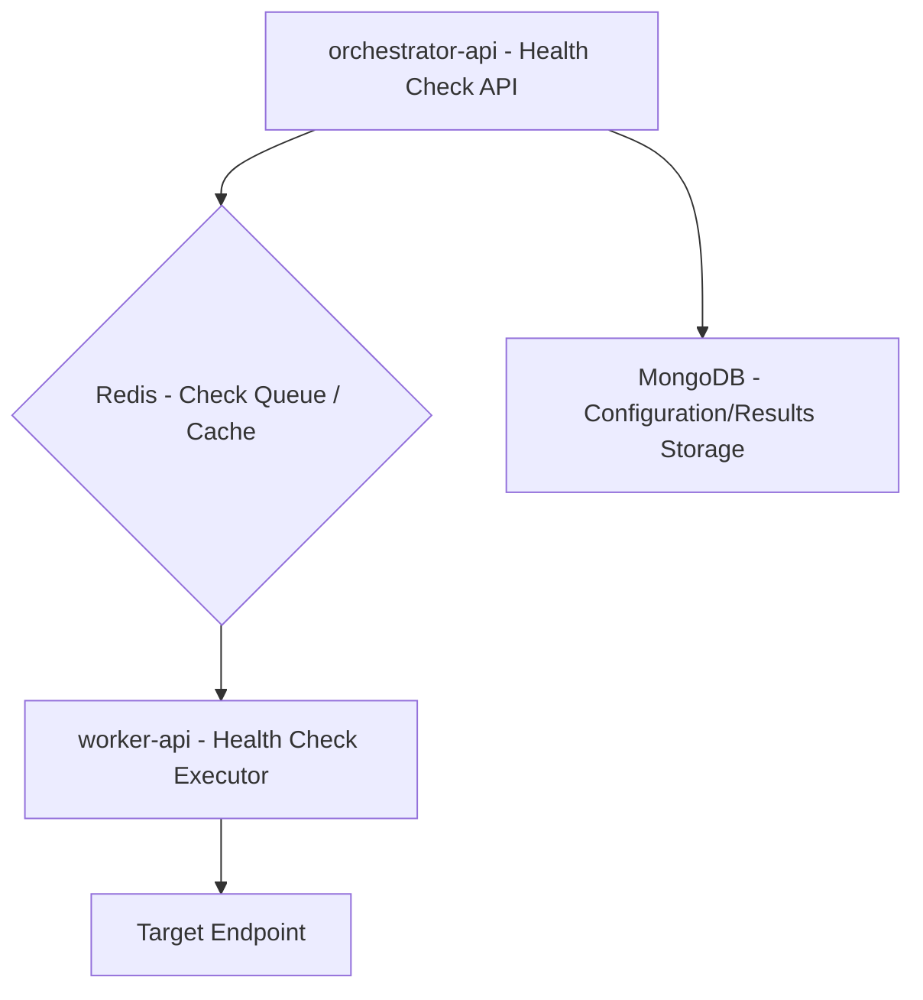

# 💫 Load Tester & Health Checker - Load Testing and Monitoring Tool

This project is a comprehensive application for **load testing** and **health checking** of APIs and services. Developed with **React**, **TypeScript**, **TailwindCSS**, and **ShadCN UI** on the frontend, and APIs in **Node.js**/**TypeScript** on the backend.

The load testing tool allows sending a configurable number of HTTP requests to a target URL and visualizing performance statistics and graphs. The health check functionality allows continuous monitoring of endpoint availability and performance.

---

## 🚀 Project Architecture

The project is modular and divided into several services that communicate to provide load testing and health check functionalities.

### Load Test Architecture

The load test architecture is designed to be scalable and efficient, using queues to process test requests.



**Flow:**
1.  The user interacts with the `load-tester-app` (frontend) to configure and start a load test.
2.  The `load-tester-app` sends the test request to the `loadtest-api`.
3.  The `loadtest-api` enqueues the test tasks in **Redis** and stores the test metadata in **MongoDB**.
4.  The `loadtest-worker` consumes tasks from **Redis**, executes HTTP requests to the target URL, and sends the results back to the `loadtest-api` (which persists them in MongoDB).

### Health Check Architecture

The health check architecture allows continuous monitoring of endpoints, with dedicated workers for executing checks.



**Flow:**
1.  The `orchestrator-api` manages health check configurations and enqueues check tasks in **Redis**.
2.  Configurations and results are persisted in **MongoDB**.
3.  The `worker-api` consumes tasks from **Redis**, executes checks on the target endpoints, and reports the results back to the `orchestrator-api`.

---

## ✨ Features

### Load Testing

-   Customizable configuration for:
    -   Target URL
    -   Number of requests
    -   Concurrency level
    -   Method (GET/POST) and JSON payload submission
-   Results display:
    -   Number of successes and failures
    -   Total response time (minimum, average, and maximum)
    -   Time to first and last byte
-   Graphs:
    -   Status code per request (pie chart)
    -   Response time per request (line chart)
    -   Response time histogram
    -   Average time per status code (bar chart)
-   Reports:
    -   Interactive visualization on report pages with vertical scrolling (snap)
    -   Export results as JSON
    -   Search reports by date range
-   Responsive and modern interface with **TailwindCSS** + **ShadCN UI**

### Health Check

-   Continuous monitoring of HTTP/HTTPS endpoints.
-   Configurable check intervals.
-   Availability status logging.
-   Historical check visualization.
-   Notifications (future).

---

## 📦 Technologies Used

-   **Frontend**
    -   React + Vite
    -   TypeScript
    -   TailwindCSS
    -   ShadCN UI
    -   Axios (for HTTP calls)
    -   React Router DOM (navigation)
    -   Chart.js + react-chartjs-2 (charts)
    -   FileSaver (JSON export)

-   **Backend (APIs and Workers)**
    -   Node.js
    -   TypeScript
    -   Express
    -   Custom load testing and health check engines
    -   MongoDB (database)
    -   Redis (message queue / cache)

---

## 🚀 🐳 Como Rodar o Projeto

### Prerequisites

-   [Docker](https://www.docker.com/) and [Docker Compose](https://docs.docker.com/compose/) (required)

---

You can easily bring up the entire stack (frontend, APIs, workers, MongoDB, Redis) using Docker Compose:

```bash
docker compose up -d
```

Or, if you prefer, run the automated script directly from GitHub:

```bash
curl -sSL https://raw.githubusercontent.com/luisfelix-93/load-tester/prod/loadtester-install.sh | bash
```

Após a execução, acesse a aplicação em: [http://localhost:5173](http://localhost:5173)

## ☸️ Running with Kubernetes

In addition to Docker Compose, you can run the application in a Kubernetes cluster using the ready-made manifests in the `manifests` folder.

### Prerequisites

-   [kubectl](https://kubernetes.io/docs/tasks/tools/) configured
-   A Kubernetes cluster (local or cloud)

### Steps

1.  Access the manifests folder:
    ```bash
    cd manifests
    ```

2.  Apply all manifests:
    ```bash
    kubectl apply -f .
    ```

    This will create the deployments and services for all components: `loadtest-api`, `loadtest-app`, `loadtest-worker`, `orchestrator-api`, `worker-api`, `mongo`, and `redis`.

3.  Expose the frontend for external access (example using port-forward):
    ```bash
    kubectl port-forward svc/loadtest-app-svc 5173:5173
    ```
    Now access the application at [http://localhost:5173](http://localhost:5173).

> **Note:** If you want to expose via LoadBalancer or Ingress, adjust the Service type according to your infrastructure.

### Manifests Structure

-   `api-deployment.yaml` — Deployment for `loadtest-api`
-   `api-service.yaml` — Service for `loadtest-api`
-   `frontend-deployment.yaml` — Deployment for `loadtest-app`
-   `frontend-service.yaml` — Service for `loadtest-app`
-   `loadtest-worker-deployment.yaml` — Deployment for `loadtest-worker`
-   `loadtest-worker-hpa.yaml` — Horizontal Pod Autoscaler for `loadtest-worker`
-   `mongo-deployment.yaml` — Deployment for MongoDB
-   `mongo-service.yaml` — Service for MongoDB
-   `orchestrator-api-deployment.yaml` — Deployment for `orchestrator-api`
-   `orchestrator-api-service.yaml` — Service for `orchestrator-api`
-   `redis-deployment.yaml` — Deployment for Redis
-   `redis-service.yaml` — Service for Redis
-   `worker-api-deployment.yaml` — Deployment for `worker-api`
-   `worker-api-service.yaml` — Service for `worker-api`

---

## 📈 Usage Flow

### Load Testing:

1.  Access the home page.
2.  Enter the target URL, number of requests, concurrency, method (GET/POST), and payload (if POST).
3.  Start the test.
4.  View the results summary, including performance graphs.
5.  Browse previous reports or search by date range.
6.  Export results as JSON, if desired.

### Health Check:

1.  Access the health check page;
2.  Enter the URL of the endpoint you want to monitor;
3.  View the summary of requests made, minute by minute.

---

## 🛠️ Future Improvements

-   Export results to CSV
-   Authentication support (JWT, Basic Auth)
-   Advanced filters in reports
-   Notifications for health checks (email, Slack, etc.)
-   Health check monitoring dashboard

---

## 📄 License

This project is licensed under the MIT License.
Feel free to use, modify, and contribute!

---

# ⚡ Developed by

Luis Felipe Felix Filho
[LinkedIn](https://www.linkedin.com/in/luis-felix-filho/) • [GitHub](https://github.com/luisfelix-93)

---

## Badges

```markdown


```